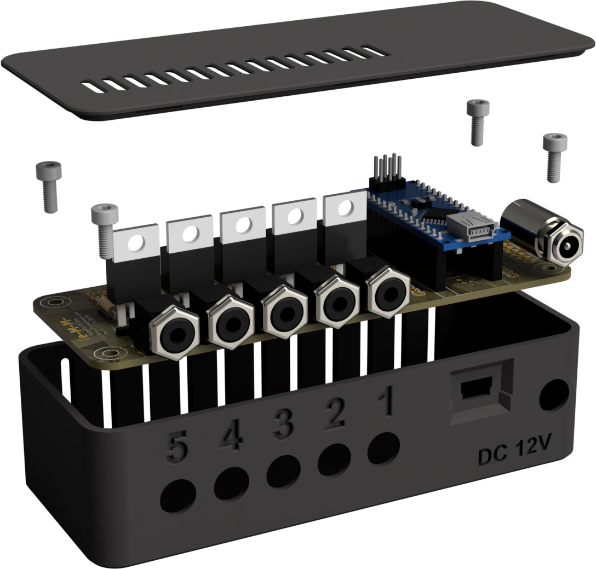

# Enclosure 3D Files
FETbox 3D-printing and CAD design resources. See [Build Guide](https://plateflo.readthedocs.io/en/latest/hardware/build_guide.html#d-printing-guidelines) for 3D-printing guidelines & assembly.

File | Description
---:  | :---
STLs\\*.stl | 3D print files. Oriented for FDM 3D-printing.
CAD\FETbox_complete.f3d | Complete Fusion360 model, including key board components.
CAD\FETbox_complete.step | As above, but compatible with open-source software.

## CAD Model Exploded Render
