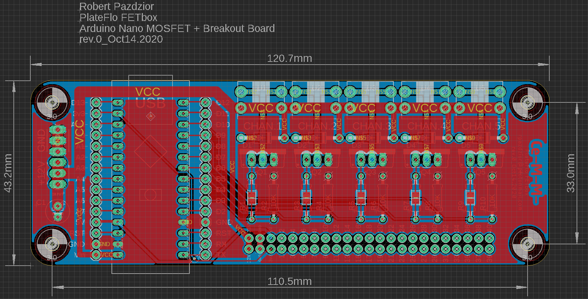
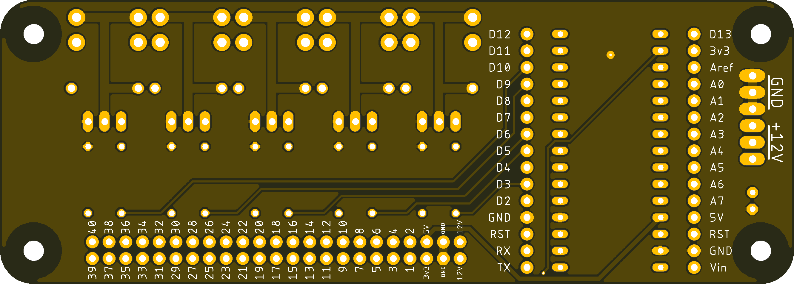

# PCB
See [project documentation](https://plateflo.readthedocs.io/en/latest/hardware/build_guide.html#fetbox-hardware-controller) for manufacture and assembly guides.

## Files
File | Description
--- | ---
FETbox_rev0_Gerber_JLCPCB.zip | JLCPCB CAM (Gerber) files for production
EAGLE\FETbox_rev0_PCB.brd | EAGLE board
EAGLE\FETbox_rev0_PCB.sch | EAGLE schematic
EAGLE\\*.b#[0-9] | EAGLE routing support files
EAGLE\\*.pro | EAGLE auto-routing stats file
FETbox_rev0_schematic.pdf/dxf | Circuit diagram

## Overview

## Top

## Bottom

