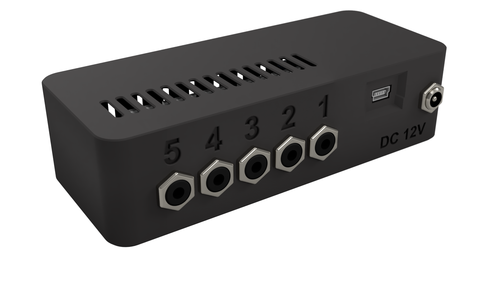

# PlateFlo FETbox - Hardware Controller
FETbox hardware controller for the PlateFlo plate-scale perfusion tissue culture
system.

See [HardwareX]() and [ReadTheDocs]() for further description and documentation.

## Description
Hosted here are all of the necessary files to build a FETbox hardware
controller. Source files are also included should you with to make 
modifications for your application.
* Enclosure
    * .STLs (for 3D printing)
    * CAD 
* PCB
    * [JLCPCB](https://jlcpcb.com/) CAM files (for PCB ordering)
    * EAGLE `.SCH` and `.BRD` source files
* Arduino Nano firmware

## License
This project is copyright of Robert Pazdzior (2020-2021)

It is provided under the terms of the [CERN Open Hardware License
(CERN-OHL-W)](https://cern-ohl.web.cern.ch/home). A copy of the license is
included [here](LICENSE).